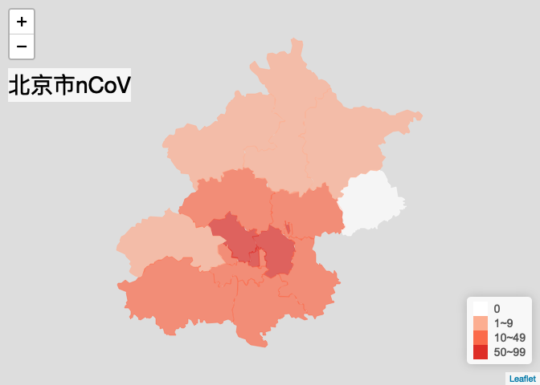

covid-19 data retrieve, and visualization using leaflet
================
2020年03月21日

[](https://travis-ci.com/yiluheihei/ncovmap)
[](https://creativecommons.org/licenses/by/4.0/)

English | [简体中文](README.md)

``` r
knitr::opts_chunk$set(
  fig.path = "man/figures/",
  message = FALSE
)
```

## Data source

  - raw data from
    [DXY-COVID-19-Data](https://github.com/BlankerL/DXY-COVID-19-Data)
  - preprocessed data from
    [nCoV-2019-Data](https://github.com/yiluheihei/nCoV-2019-Data)

## Installation

``` r
if (!require(remotes)) install.packages("remotes")
if (!require(ncovmap)) remotes::install_github("yiluheihei/ncovmap")
```

Feature:

  - `get_ncov2()`: retrieve latest or time-series data of covid-2019
  - `plot_china_map()`: plot on china map
  - `plot_province_map()`: plot on province map of china
  - `plot_world_map()`: plot on world map
  - `plot_foreign_map()`: plot on japan, korea, italy or iran map

<!-- end list -->

``` r
library(ncovmap)
library(leafletCN)
library(magrittr) # for pipe
```

## How to use

### Data retrieve

``` r
# latest data
ncov <- get_ncov2(method = "api")
# ncov class inherit from data.frame
ncov
```

    ## All COVID 2019 Data
    ## Updated at 2020-03-21 02:59:14 
    ## From https://github.com/BlankerL/DXY-COVID-19-Data

``` r
data.frame(ncov) %>%
  head()
```

    ##   continentName continentEnglishName  countryName countryEnglishName
    ## 1          欧洲               Europe       爱尔兰            Ireland
    ## 2        大洋洲              Oceania 新喀里多尼亚               <NA>
    ## 3          亚洲                 Asia     斯里兰卡           SriLanka
    ## 4          非洲               Africa       突尼斯            Tunisia
    ## 5        北美洲        North America       阿鲁巴               <NA>
    ## 6          欧洲               Europe       立陶宛          Lithuania
    ##   provinceName provinceEnglishName province_zipCode province_confirmedCount
    ## 1       爱尔兰             Ireland           961003                     683
    ## 2 新喀里多尼亚                <NA>                0                       2
    ## 3     斯里兰卡            SriLanka           953007                      71
    ## 4       突尼斯             Tunisia           981006                      54
    ## 5       阿鲁巴                <NA>                0                       5
    ## 6       立陶宛           Lithuania           964004                      63
    ##   province_suspectedCount province_curedCount province_deadCount cityName
    ## 1                       0                   0                  3     <NA>
    ## 2                       0                   0                  0     <NA>
    ## 3                       0                   1                  0     <NA>
    ## 4                       0                   0                  0     <NA>
    ## 5                       0                   0                  0     <NA>
    ## 6                       0                   0                  0     <NA>
    ##   cityEnglishName city_confirmedCount city_suspectedCount city_curedCount
    ## 1            <NA>                  NA                  NA              NA
    ## 2            <NA>                  NA                  NA              NA
    ## 3            <NA>                  NA                  NA              NA
    ## 4            <NA>                  NA                  NA              NA
    ## 5            <NA>                  NA                  NA              NA
    ## 6            <NA>                  NA                  NA              NA
    ##   city_deadCount city_zipCode          updateTime
    ## 1             NA           NA 2020-03-21 02:59:14
    ## 2             NA           NA 2020-03-21 02:59:14
    ## 3             NA           NA 2020-03-21 02:59:14
    ## 4             NA           NA 2020-03-21 02:59:14
    ## 5             NA           NA 2020-03-21 02:59:14
    ## 6             NA           NA 2020-03-21 02:59:14

### Data subset

``` r
# china data
china <- ncov['china']
china
```

    ## China COVID 2019 Data
    ## Updated at 2020-03-21 02:59:14 
    ## From https://github.com/BlankerL/DXY-COVID-19-Data

``` r
# Hubei province of china
hubei <- ncov['Hubei']
hubei
```

    ## Hubei COVID 2019 Data
    ## Updated at 2020-03-21 02:03:01 
    ## From https://github.com/BlankerL/DXY-COVID-19-Data

``` r
# Beijing
beijing <- ncov['Beijing']
# world data
world <- ncov['world']
world
```

    ## World COVID 2019 Data
    ## Updated at 2020-03-21 02:59:14 
    ## From https://github.com/BlankerL/DXY-COVID-19-Data

``` r
data.frame(world) %>% 
  head()
```

    ##    countryEnglishName   provinceName continentName continentEnglishName
    ## 1             Albania     阿尔巴尼亚          欧洲               Europe
    ## 2             Algeria     阿尔及利亚          非洲               Africa
    ## 3             Andorra         安道尔          欧洲               Europe
    ## 4 Antigua and Barbuda 安提瓜和巴布达        北美洲        North America
    ## 5           Argentina         阿根廷        南美洲        South America
    ## 6             Armenia       亚美尼亚          亚洲                 Asia
    ##      countryName provinceEnglishName province_zipCode province_confirmedCount
    ## 1     阿尔巴尼亚             Albania           965001                      70
    ## 2     阿尔及利亚             Algeria           981001                      90
    ## 3         安道尔             Andorra           965002                      75
    ## 4 安提瓜和巴布达 Antigua and Barbuda           974001                       1
    ## 5         阿根廷           Argentina           973001                     158
    ## 6       亚美尼亚             Armenia           955002                     136
    ##   province_suspectedCount province_curedCount province_deadCount cityName
    ## 1                       0                   0                  2     <NA>
    ## 2                       0                  12                  7     <NA>
    ## 3                       0                   1                  0     <NA>
    ## 4                       0                   0                  0     <NA>
    ## 5                       0                   1                  3     <NA>
    ## 6                       0                   1                  0     <NA>
    ##   cityEnglishName city_confirmedCount city_suspectedCount city_curedCount
    ## 1            <NA>                  NA                  NA              NA
    ## 2            <NA>                  NA                  NA              NA
    ## 3            <NA>                  NA                  NA              NA
    ## 4            <NA>                  NA                  NA              NA
    ## 5            <NA>                  NA                  NA              NA
    ## 6            <NA>                  NA                  NA              NA
    ##   city_deadCount city_zipCode          updateTime
    ## 1             NA           NA 2020-03-21 02:59:14
    ## 2             NA           NA 2020-03-21 02:59:14
    ## 3             NA           NA 2020-03-21 02:03:01
    ## 4             NA           NA 2020-03-21 02:03:01
    ## 5             NA           NA 2020-03-21 02:59:14
    ## 6             NA           NA 2020-03-21 02:59:14

### china map

``` r
plot_china_map(china, legend_position = "bottomleft")
```

<!-- -->

### province map of china

Hubei province

``` r
plot_province_map(
  hubei, 
  "Hubei", 
  bins = c(0, 100, 200, 500, 1000, 10000)
)
```

<!-- -->

Beijing

``` r
plot_province_map(
  beijing,
  "Beijing", 
  bins = c(0, 10, 50, 100)
)
```

<!-- -->

### world map

``` r
plot_world_map(world, legend_position = "bottomleft")
```

<!-- -->

### korea map

``` r
korea_ncov <- get_foreign_ncov("韩国")
plot_foreign_map(korea_ncov, "korea")
```

<!-- -->

### japan map

``` r
jp_ncov <- get_foreign_ncov("日本")
plot_foreign_map(jp_ncov, "japan")
```

<!-- -->

### iran map

``` r
iran_ncov <- get_foreign_ncov("伊朗")
plot_foreign_map(iran_ncov, "iran")
```

<!-- -->

### italy map

``` r
italy_ncov <- get_foreign_ncov("意大利")
plot_foreign_map(italy_ncov, "italy")
```

<!-- -->

## plot multiple maps

``` r
## not run
foreign_countries <- c("韩国", "伊朗", "日本", "意大利")
names(foreign_countries) <- c("korea", "iran", "japan", "italy")
htmltools::tagList(purrr::imap(
  foreign_countries, 
  ~ get_foreign_ncov(.x) %>% 
    plot_foreign_map(.y)
))
```

## Acknowlegement

  - [DXY-COVID-19-CrawlerAPI](https://github.com/BlankerL/DXY-COVID-19-Crawler)
  - [DXY-COVID-19-Data](https://github.com/BlankerL/DXY-COVID-19-Data)
