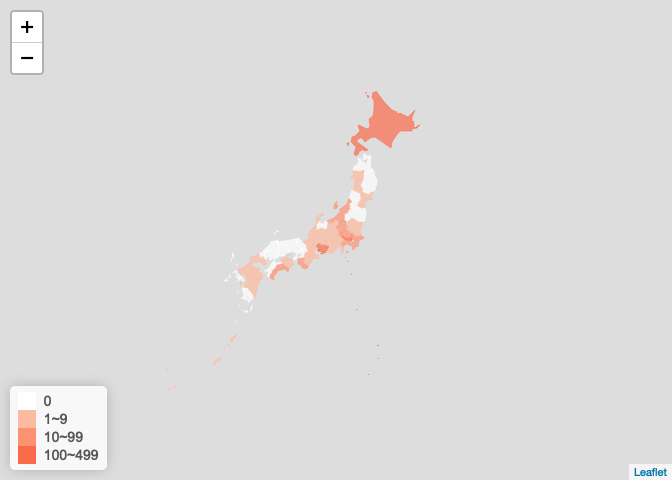
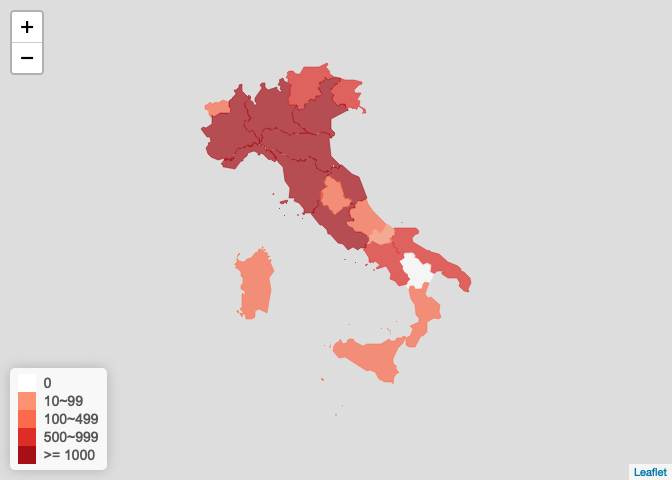

ncov 2019
================
2020年03月21日

[](https://travis-ci.com/yiluheihei/ncovmap)
[](https://creativecommons.org/licenses/by/4.0/)

简体中文 | [English](README.md)

``` r
knitr::opts_chunk$set(
  fig.path = "man/figures/",
  message = FALSE
)
```

ncov 疫情图，参考[ncovr](https://github.com/pzhaonet/ncovr),
具体使用详情见[vignette](https://yiluheihei.github.io/ncovmap/articles/Introduction.html).
暂放于此，后续可并入[ncovr](https://github.com/pzhaonet/ncovr)

## 数据来源

数据获取通过[DXY-COVID-19-Crawler](https://github.com/BlankerL/DXY-COVID-19-Crawler)
api 下载，调用`get_ncov()`即可获取。

## 安装

``` r
if (!require(remotes)) install.packages("remotes")
if (!require(ncovmap)) remotes::install_github("yiluheihei/ncovmap")
```

``` r
library(ncovmap)
library(leafletCN)
```

## 下载ncov数据

``` r
ncov <- get_ncov2(method = "api")
ncov
```

    ## All COVID 2019 Data
    ## Updated at 2020-03-21 02:59:14 
    ## From https://github.com/BlankerL/DXY-COVID-19-Data

## 提取省市或国家数据

``` r
# 中国数据
china <- ncov['china']
china
```

    ## China COVID 2019 Data
    ## Updated at 2020-03-21 02:59:14 
    ## From https://github.com/BlankerL/DXY-COVID-19-Data

``` r
# 省市数据
hubei <- ncov['湖北省']
hubei
```

    ## Hubei COVID 2019 Data
    ## Updated at 2020-03-21 02:03:01 
    ## From https://github.com/BlankerL/DXY-COVID-19-Data

``` r
beijing <- ncov['北京市']
beijing
```

    ## Beijing COVID 2019 Data
    ## Updated at 2020-03-21 02:03:01 
    ## From https://github.com/BlankerL/DXY-COVID-19-Data

``` r
beijing$cities
```

    ## NULL

``` r
# 世界数据
world <- ncov['world']
world
```

    ## World COVID 2019 Data
    ## Updated at 2020-03-21 02:59:14 
    ## From https://github.com/BlankerL/DXY-COVID-19-Data

## 国内总体疫情图

``` r
plot_china_map(china, legend_position = "bottomleft")
```

<!-- -->

## 省份疫情图

湖北省

``` r
plot_province_map(
  hubei, 
  "湖北省", 
  bins = c(0, 100, 200, 500, 1000, 10000)
)
```

<!-- -->

北京市

``` r
plot_province_map(
  beijing,
  "北京市", 
  bins = c(0, 10, 50, 100)
)
```

<!-- -->

## 世界整体疫情图

``` r
plot_world_map(world, legend_position = "bottomleft")
```

<!-- -->

## 国外疫情图

### 韩国疫情图

``` r
korea_ncov <- get_foreign_ncov("韩国")
plot_foreign_map(korea_ncov, "korea")
```

<!-- -->

### 日本疫情图

``` r
jp_ncov <- get_foreign_ncov("日本")
plot_foreign_map(jp_ncov, "japan")
```

<!-- -->

### 伊朗疫情图

``` r
iran_ncov <- get_foreign_ncov("伊朗")
plot_foreign_map(iran_ncov, "iran")
```

<!-- -->

### 意大利疫情图

``` r
italy_ncov <- get_foreign_ncov("意大利")
plot_foreign_map(italy_ncov, "italy")
```

<!-- -->

### 直接画这四个国家的疫情图

``` r
foreign_countries <- c("韩国", "伊朗", "日本", "意大利")
names(foreign_countries) <- c("korea", "iran", "japan", "italy")
htmltools::tagList(purrr::imap(
  foreign_countries, 
  ~ get_foreign_ncov(.x) %>% 
    plot_foreign_map(.y)
))
```

## 致谢

谢谢BlankerL的提供[API](https://github.com/BlankerL/DXY-COVID-19-Crawler)和
[数据仓库](https://github.com/BlankerL/DXY-COVID-19-Data)
