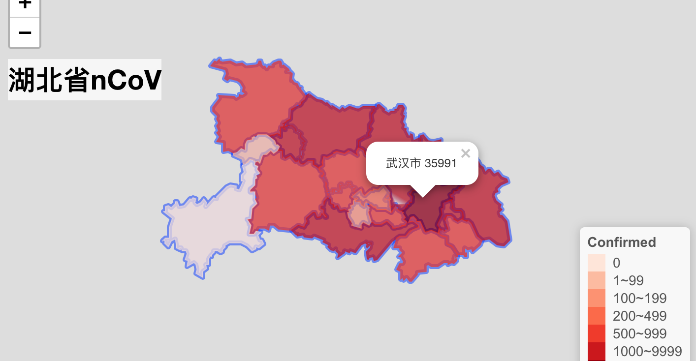

```{r, include = FALSE}
knitr::opts_chunk$set(
  collapse = TRUE,
  comment = "#>",
  warning = FALSE
)
```

```{r setup}
library(magrittr)
```


用leafletCN画省份疫情图存在两个问题，一是leafletCN中地图数据跟ncov数据中城市的
名字不一致，可能是一些城市已经改名，如襄樊已经改成襄阳，北京市早已把撤县设区，
而现有数据中还是县；或者是ncov中采用了地名的缩写。二是需要把除该省之外的区域去
掉，以便很好的展示，虽然通过修改`geojsonMap`中`tileType`参数可以实现，但是map
周围存在边线（如下图所示存在蓝色边线）。

```{r old-leafletCN-map}

```

## 更新leafletCN中地图数据

所以，要想画疫情省份图，首先对
[leafletCN](https://github.com/Lchiffon/leafletCN)中地图数据更新，我把其中的关于省和直辖市地图数据更新了一下，然后修改了`geojsonMap()`可通过设置
`tileType = NULL`去除map周围边线。可以从
[这里](https://github.com/Lchiffon/leafletCN)安装。目前没有对地级市数据进行更
新，并且我所用的地图数据也不是最新的数据，可能存在个别城市名字错误(目前还没发
现任何错误)。

```{r eval=FALSE}
# 安装修改后的leafletCN
devtools::install_github("yiluheihei/leafletCN")
```

```{r leafletCN-load}
library(leafletCN)
```

## 画省份的疫情图

ncov数据中有个别城市名字是用缩写，比如湖北省的如"恩施州"实际上是"恩施土家族苗
族自治州"。所以再画图之前首先需要对ncov中城市的名字和地图数据中的名字进行对应。

然后就是写函数画图，主要包含两个函数`plot_province_map()`和
`plot_province_map2()`。

1. `plot_province_map()`。把数据分组稍微作了修改，提供`bins`参数，为了突出没有感染ncov的城市（例数为0）
，只要有0例的城市存在，就手动设置它的颜色为白色。如
`bins = c(1, 10, 100)`分组为1~9,10~99,>=100，如果存在例数为0的城市，那么会多一
个0组。

2. `plot_province_map2()`。完全参考`ncovr::plot_map()`写的，只是添加了`bins`参数。

另外还参考`ncovr::plot_map()`的`method`参数，感觉省份图基本用不到`log`处理，目前只是把bins简单设置成了4。

## 例子

读取数据，加载包

```{r data}
if (!require(devtools)) install.packages("devtools")
if (!require(ncovmap)) devtools::install_github("yiluheihei/ncovmap")
library(ncovmap)
ncov <- get_ncov()
```

`plot_province_map()`画图

```{r map_hubei}
# 例数为0的城市以白色突出显示
hubei <- ncov["湖北省"]
plot_province_map(hubei, "湖北省", bins = c(0, 100, 200, 500, 1000, 10000)
)
```

```{r map_guangdong}
guangdong <- ncov["广东省"]
plot_province_map(guangdong, "广东省", bins = c(0, 10, 100, 200))
```

`plot_province_map2()`画图

```{r map2_hubei}
plot_province_map2(hubei, "湖北省", bins = c(0, 100, 200, 500, 1000, 10000))
```

```{r map2_guangdong}
plot_province_map2(guangdong, "广东省", bins = c(0, 10, 100, 200))
```

直接画所有省份图，台湾,香港,澳门数据没有细分，不需要画。
 
```{r all-province}
# 没有台湾,香港,澳门,南海等地数据
provinces <- setdiff(
  mapNames$name,
  c("台湾省", "香港特别行政区", 
    "澳门特别行政区", "南海诸岛", "中国"
  )
)

htmltools::tagList(purrr::map(provinces, 
  ~ plot_province_map(ncov[.x], .x, bins = c(0, 10, 100, 500, 1000, 10000))))
```

虽然简单几行代码就可以把所有省份疫情图画出来，但是实际上根据各省份例数不同，个
性化设置`bins`才能更好的进行展示。以上面最后一张上海疫情图为例，实际上海每个区
疫情都在100以内，可以把bins设置小一些。

```{r shanghai-bin}
plot_province_map(ncov["上海市"], "上海市", bins = c(0, 5, 10, 20, 60))
```

## 国内整体疫情图

**2020年2月23日增加**

之前china map缺少南海诸岛数据，后来找到了包括南海诸岛的中国地图数据,然后
根据`ncovr::plot_map()`简单写了个`plot_china_map()`用于画国内整体疫情图。

```{r china-map}
# 国内疫情整体图, 地图中包含南海诸岛i
china <- ncov["china"]
plot_china_map(china, legend_position = "bottomleft")
```

## 世界疫情图

**2020年2月27日增加**

```{r world-map}
world <- ncov["world"]
plot_world_map(world, legend_position = "bottomleft")
```

